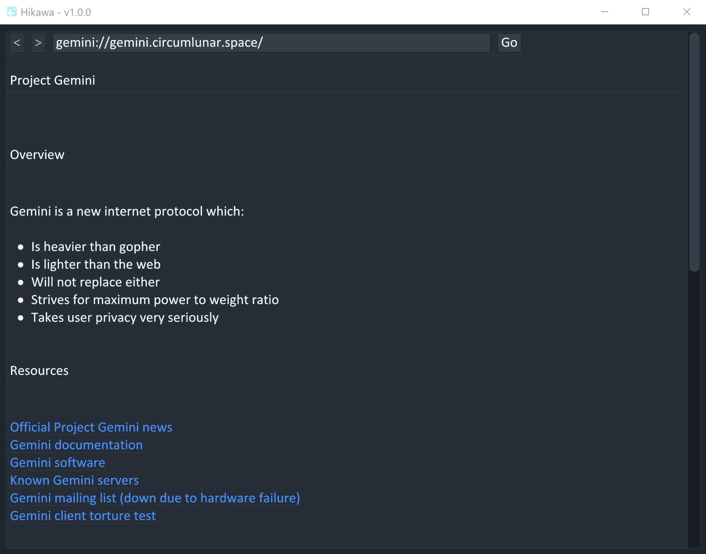

# Hikawa

A simple Gemini graphical browser in Go.



## Development

Install [tdm-gcc](https://jmeubank.github.io/tdm-gcc/) and add `/bin` to path.

Build and run with:

```
make

./main
```

## Testing

```
make test
```